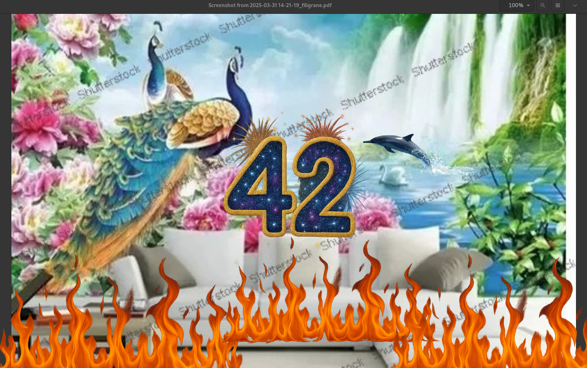
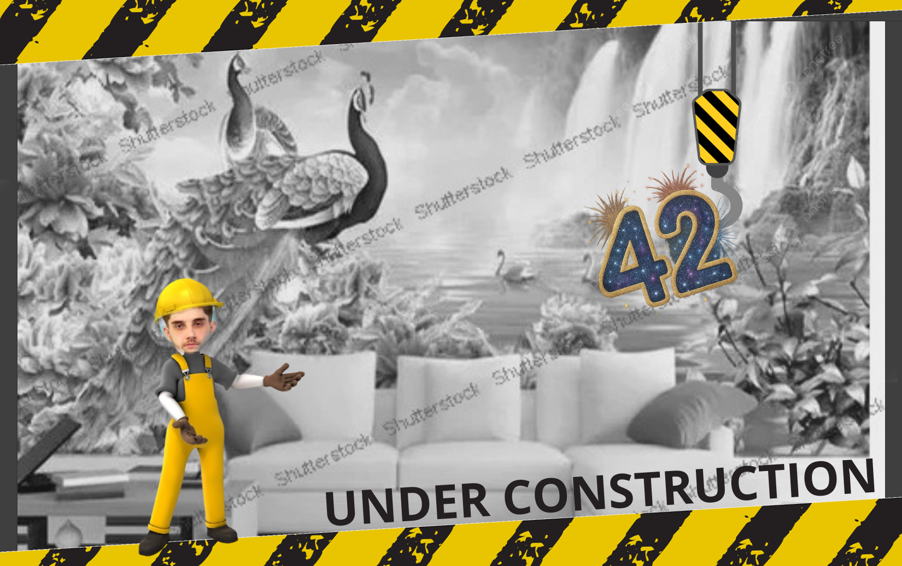
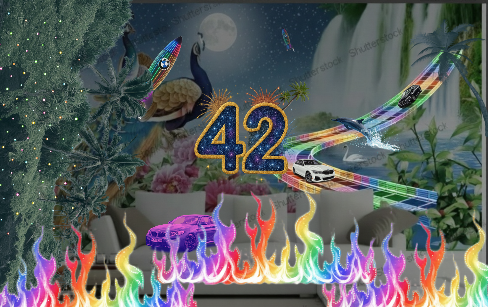
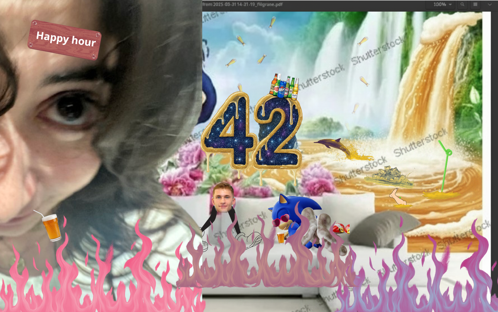
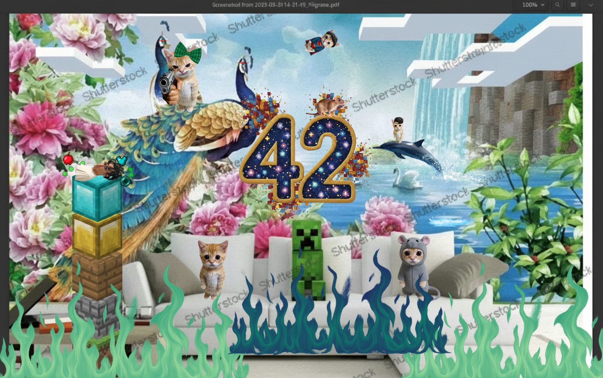
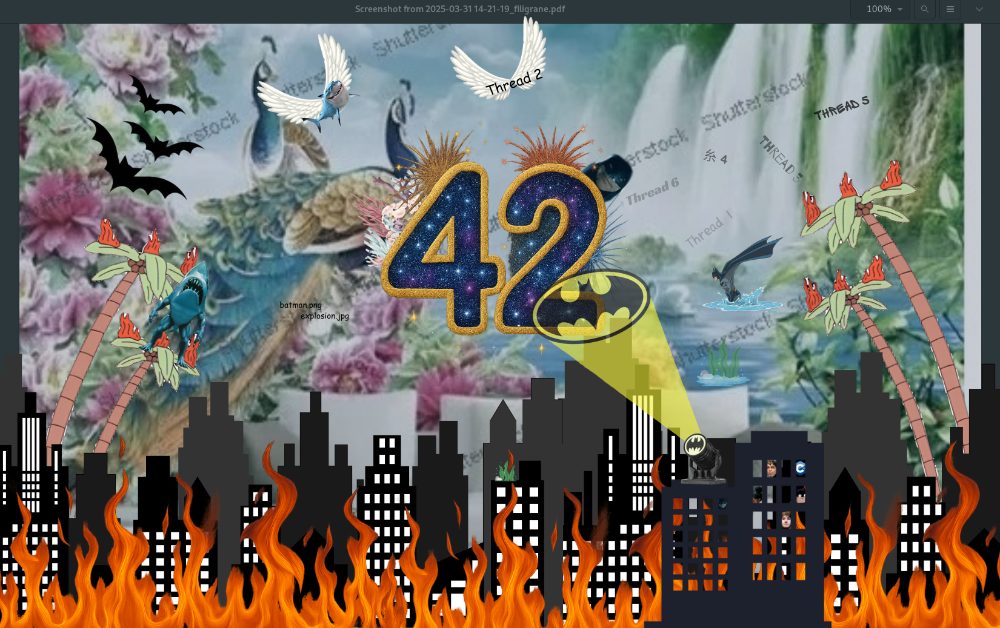
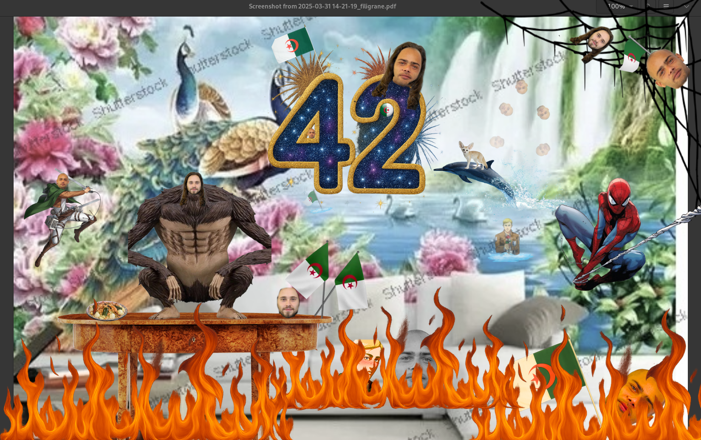

<header style="background: linear-gradient(135deg, #667eea 0%, #764ba2 100%); color: white; padding: 60px 20px; text-align: center;">
    <h1 style="font-size: 3em; margin: 0 0 10px 0;">🎨 Wallpaper Collection</h1>
    
Stunning, jaw-dropping, high-quality custom wallpapers for everyone at 42 Nice.

</header>

    

        <h2 style="margin: 0 0 15px 0; color: #667eea;">🖼️ Gallery</h2>
    

<table>
  <tr>
    <td align="center">
       
      <b>Original</b>
    </td>
    <td align="center">
       
      <i></i>
    </td>
  </tr>
  <tr>
    <td align="center">
       
      <b>fdiop</b>
    </td>
    <td align="center">
       
      <b>macorso</b>
    </td>
  </tr>
  <tr>
    <td align="center">
       
      <b>cmontaig</b>
    </td>
    <td align="center">
       
      <b>cngogang</b>
    </td>
  </tr>
  <tr>
    <td align="center">
       
      <b>erahal</b>
    </td>
    <td align="center">
       
      <b>ttchermu</b>
    </td>
  </tr>
</table>

<footer style="text-align: center; padding: 40px 20px; background: white; margin-top: 60px;">
    
Made with ❤️ at 42 School.

</footer>
